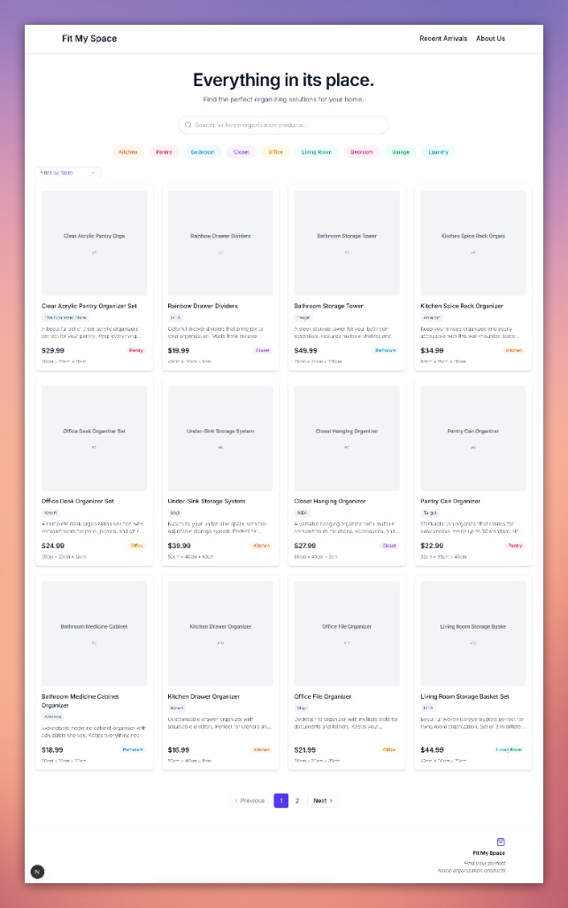

# 🏠 FitMySpace



**FitMySpace** is a modern, search engine designed to help users find the perfect home organization products across various e-commerce platforms.

Inspired by the clean and aesthetic approach of _The Home Edit_, this project combines a minimalist design with powerful filtering capabilities, allowing users to organize their homes room by room with ease.

## ✨ Key Features

- **Smart Search:** Find organizers across multiple stores (IKEA, Target, The Container Store, etc.) in one place.
- **Advanced Filtering:** Filter by room (Kitchen, Pantry, Bathroom, etc.) and store to find exactly what you need.
- **Product Details:** Detailed product views with dimensions and direct links to purchase.
- **Recent Arrivals:** Stay updated with the latest organizational products.
- **Accessible by Design:** Built with Radix UI Primitives and strictly following WCAG AA standards (Keyboard nav, Screen Readers).
- **Premium Aesthetic:** A clean, clutter-free UI with subtle rainbow accents and smooth micro-interactions.
- **High Performance:** Powered by Next.js 16 (SSR/ISR/SSG) and TanStack Query.

## 🛠️ The Tech Stack

- **Framework:** Next.js 16 (App Router)
- **Language:** TypeScript
- **Styling:** TailwindCSS 4
- **Components:** Radix UI Primitives & Lucide Icons
- **Data Fetching:** TanStack Query (React Query)
- **State Management:** URL-based state (search params)
- **Testing:** Jest, React Testing Library, MSW, `jest-axe`

## 🚀 Getting Started

Prerequisites: Node.js 18+ and npm.

```bash
# Clone the repository
git clone https://github.com/mariana-martins/fitmyspace.git

# Install dependencies
npm install

# Run the development server
npm run dev
```

Open [http://localhost:3000](http://localhost:3000) with your browser to see the result.

## 🧪 Running Tests

We maintain a rigorous testing standard with over 280+ tests covering unit, integration, and accessibility scenarios.

```bash
# Run all tests
npm test

# Run accessibility tests
npm test -- --testPathPatterns="a11y"
```

## 📂 Documentation

For deeper architectural details, check out the `docs/` folder:

- [File Structure](docs/FILE_STRUCTURE.md)
- [Implementation Summary](docs/IMPLEMENTATION_SUMMARY.md)
- [Roadmap](docs/ROADMAP.md)

---

Built with 🌈 by Mariana Martins.
